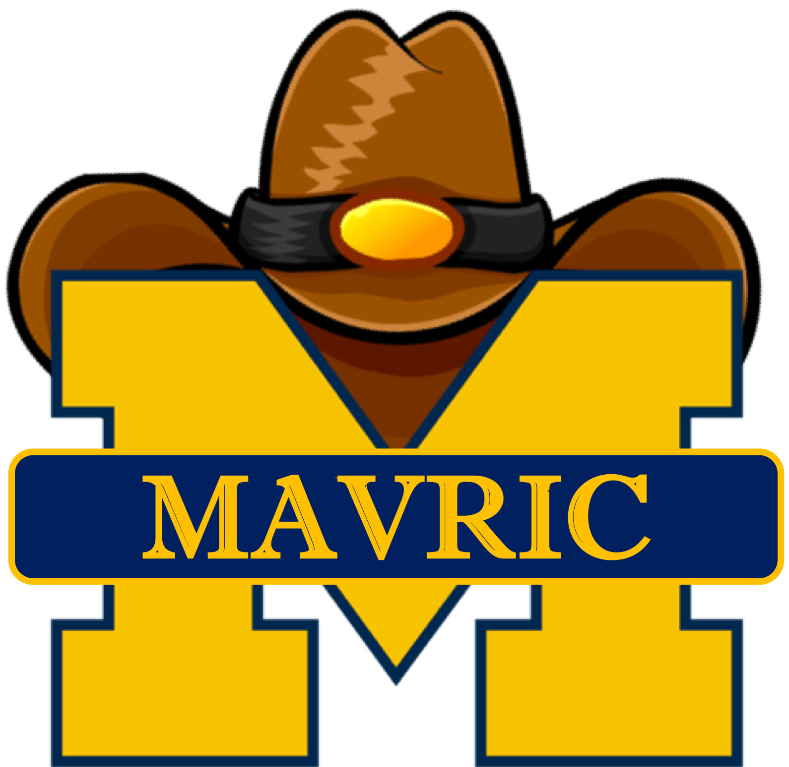

<h1> Hi! I'm Albert.</h1>

 I'm <a href="https://albertchenn.me"> Albert</a>, full time student @ The University of Michigan College of Engineering  planning on majoring in Computer Engineering with a concentration in Robotics and Vision.

<h3> My Skills </h3>

&nbsp;
&nbsp;
&nbsp;
&nbsp;
&nbsp;
&nbsp;
&nbsp;
&nbsp;
&nbsp;
&nbsp;

<h3> About Me </h3>
<ul> 
<li>  Undergraduate Research Assistant @ MAVRIC Lab</li>

<li>  I'm currently learning about Computer Vision and Human-Robot Interaction</li>

<li>  Ask about <a href=https://www.last.fm/user/alberttchen"> music</a>, working out, and food!</li>
</ul>

<h3> Connect with me! 
  

<a href="mailto:chenalb@umich.edu">
<a href="https://www.linkedin.com/in/albertchenn/">

